# Markdown
## Markdown demo
### 标题
- 使用 = 和 - 标记一级和二级标题
```
我展示的是一级标题
=================

我展示的是二级标题
-----------------
```
- 使用 # 号标记
使用 # 号可表示 1-6 级标题，一级标题对应一个 # 号，二级标题对应两个 # 号，以此类推。

### 段落
段落的换行是使用两个以上空格加上回车。
当然也可以在段落后面使用一个空行来表示重新开始一个段落。

### 字体
*斜体文本*
_斜体文本_
**粗体文本**
__粗体文本__
***粗斜体文本***
___粗斜体文本___
```
*斜体文本*
_斜体文本_
**粗体文本**
__粗体文本__
***粗斜体文本***
___粗斜体文本___
```

### 分隔线
你可以在一行中用三个以上的星号、减号、底线来建立一个分隔线，行内不能有其他东西。你也可以在星号或是减号中间插入空格。下面每种写法都可以建立分隔线：
***

* * *

*****

- - -

----------
```
***

* * *

*****

- - -

----------
```

### 删除线
~~wcoder.com~~
`~~wcoder.com~~`

### 下划线
Markdown 并无下划线的原生语法，因为会和链接的默认样式产生混淆。但是可以使用html标签实现
<u>带下划线文本</u>
`<u>带下划线文本</u>`

### 脚注
Markdown 脚注的格式:`[^要注明的文本]`

wcoder [^1]。

[^1]: `wcoder.com` -- a coder in the world!

```
wcoder [^1]。

[^1]: `wcoder.com` -- a coder in the world!
```

### 列表
- 无序列表使用星号(*)、加号(+)或是减号(-)作为列表标记，这些标记后面要添加一个空格，然后再填写内容
- 有序列表使用数字并加上 . 号来表示

#### 列表嵌套
列表嵌套只需在子列表中的选项前面添加四个空格即可：
1. 第一项：
    - 第一项嵌套的第一个元素
    - 第一项嵌套的第二个元素
2. 第二项：
    - 第二项嵌套的第一个元素
    - 第二项嵌套的第二个元素
```
1. 第一项：
    - 第一项嵌套的第一个元素
    - 第一项嵌套的第二个元素
2. 第二项：
    - 第二项嵌套的第一个元素
    - 第二项嵌套的第二个元素
```

### 区块
Markdown 区块引用是在段落开头使用 > 符号 ，然后后面紧跟一个空格符号
另外区块是可以嵌套的，一个 > 符号是最外层，两个 > 符号是第一层嵌套，以此类推
```
> 最外层
> > 第一层嵌套
> > > 第二层嵌套
```
> 最外层
> > 第一层嵌套
> > > 第二层嵌套

### 代码
```
1. `printf()` 函数
2. 代码区块使用 4 个空格或者一个制表符（Tab 键）。
3. 用 ``` 包裹一段代码，并指定一种语言（也可以不指定）
```
`printf()` 函数
```javascript
$(document).ready(function () {
    alert(''wcoder.com'');
});
```

### 链接
```
[链接名称](链接地址)

或者

<链接地址>
```
#### 高级链接
我们可以通过变量来设置一个链接，变量赋值在文档末尾进行：
```
这个链接用 1 作为网址变量 [Google][1]
这个链接用 wcoder 作为网址变量 [wcoder][wcoder]
然后在文档的结尾(也不一定要在结尾，统一在结尾是一个良好的习惯)为变量赋值（网址）

  [1]: http://www.google.com/
  [wcoder]: http://www.wcoder.com/
```
这个链接用 1 作为网址变量 [Google][1]
这个链接用 wcoder 作为网址变量 [wcoder][wcoder]
然后在文档的结尾为变量赋值（网址）

  [1]: http://www.google.com/
  [wcoder]: http://www.wcoder.com/
  
### 图片
Markdown 图片语法格式如下：
```


```

### 表格
```
|  表头   | 表头  |
|  ----  | ----  |
| 单元格  | 单元格 |
| 单元格  | 单元格 |
```
#### 对齐方式
- -: 设置内容和标题栏居右对齐。
- :- 设置内容和标题栏居左对齐。
- :-: 设置内容和标题栏居中对齐。
```
| 左对齐 | 右对齐 | 居中对齐 |
| :-----| ----: | :----: |
| 单元格 | 单元格 | 单元格 |
| 单元格 | 单元格 | 单元格 |
```

### 转义
Markdown 使用反斜杠转义特殊字符：
```
**文本加粗** 
\*\* 正常显示星号 \*\*
```


Markdown 支持以下这些符号前面加上反斜杠来帮助插入普通的符号：
```
\   反斜线
`   反引号
*   星号
_   下划线
{}  花括号
[]  方括号
()  小括号
#   井字号
+   加号
-   减号
.   英文句点
!   感叹号
```
### 注释
#### html注释
```
<!--哈哈我是注释，不会在浏览器中显示。-->
```
#### hack方法
hack方法就是利用markdown的解析原理来实现注释的。

[comment]: <> (哈哈我是注释，不会在浏览器中显示。)
[//]: <> (哈哈我是注释，不会在浏览器中显示。)
[//]: # (其中，这种方法最稳定，适用性最强)
[^_^]: # (这种方法最可爱，超级无敌萌啊)

### 上标/下标 Subscript/Superscript
```
X<sub>i</sub>
H<sub>2</sub>O  CO<sub>2</sub>
益达<sup>TM</sup>

输入上标 x^2^
输入下标 x~0~
```
X<sub>i</sub>
H<sub>2</sub>O  CO<sub>2</sub>
益达<sup>TM</sup>

输入上标 x^2^
输入下标 x~0~

## 第三方
- [wiki.js](https://docs.requarks.io/en/rendering)的请查看文档支持

### TOC 目录
在文档最上方添加
```
[TOC]
```
### 任务列表 Task List
- [x] 任务1，已完成;
- [x] 任务2，已完成;
- [ ] 任务3，未完成; 

### 扩展选项卡 Expand Tabs
- pymdownx.tabbed
```
=== "Tab 1"
    Markdown **content**.

    Multiple paragraphs.

=== "Tab 2"
    More Markdown **content**.

    - list item a
    - list item b
```
    
- wiki.js
```
### Tabset {.tabset}
#### Tab 1
Markdown **content**.  
Multiple paragraphs.

#### Tab 2
More Markdown **content**.
- list item a
- list item b
```

### Tabset {.tabset}
#### Tab 1
Markdown **content**.  
Multiple paragraphs.

#### Tab 2
More Markdown **content**.
- list item a
- list item b


### 备注
*[HTML]: Hyper Text Markup Language
*[W3C]:  World Wide Web Consortium
The HTML specification
is maintained by the W3C.
> 其实就是转换成`<abbr>`html标签

> warning.{.is-warning}

> success.{.is-success}

> info.{.is-info}

> danger.{.is-danger}


### Emoji
:apple:

### 公式
- mathjax
- KaTeX
- Latex

```
$$
e^{x^2}\neq{e^x}^2
$$

$$H(D_2) = -(\frac{2}{4}\ log_2 \frac{2}{4} + \frac{2}{4}\ log_2 \frac{2}{4}) = 1$$
```

$$
e^{x^2}\neq{e^x}^2
$$

$$H(D_2) = -(\frac{2}{4}\ log_2 \frac{2}{4} + \frac{2}{4}\ log_2 \frac{2}{4}) = 1$$

### 流程图、时序图(顺序图)、甘特图
- [mermaid](http://mermaid-js.github.io/mermaid/)
- [flowchat](http://flowchart.js.org/)
- [Sequence](https://bramp.github.io/js-sequence-diagrams/)
- [PlantUML](https://plantuml.com/zh/)

#### 流程图 Flowchart
- 横向流程图
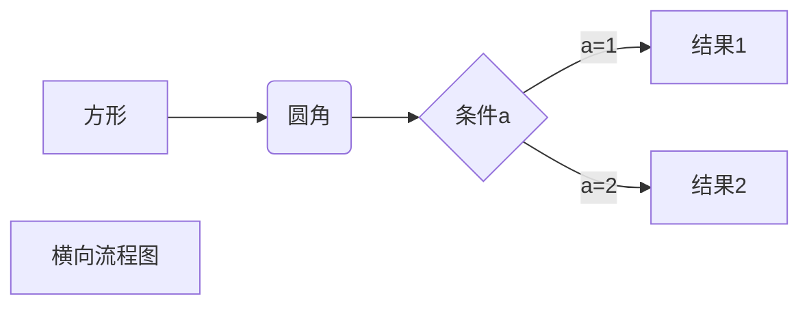

- 竖向流程图

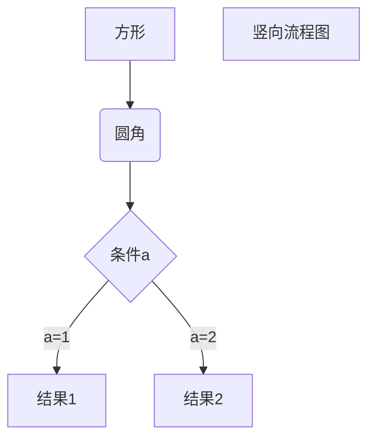
- 标准流程图

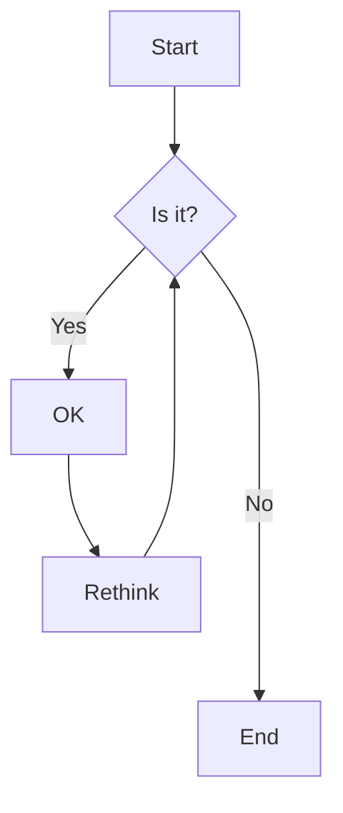
#### 时序图(顺序图) Sequence 

- UML标准时序图

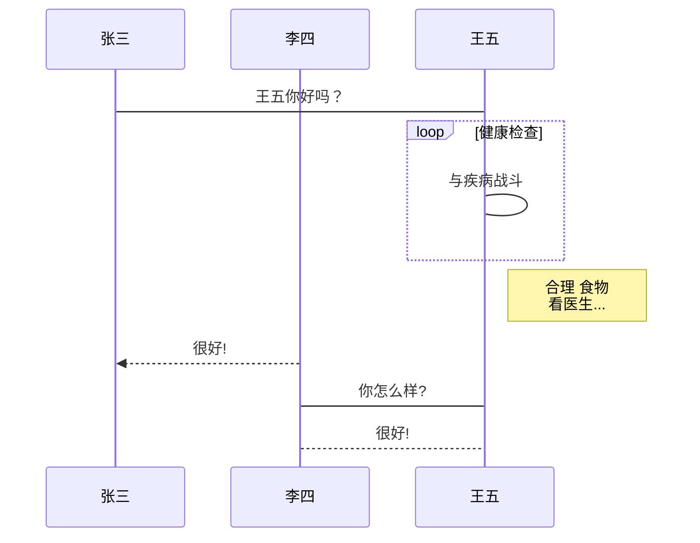
- 时序图
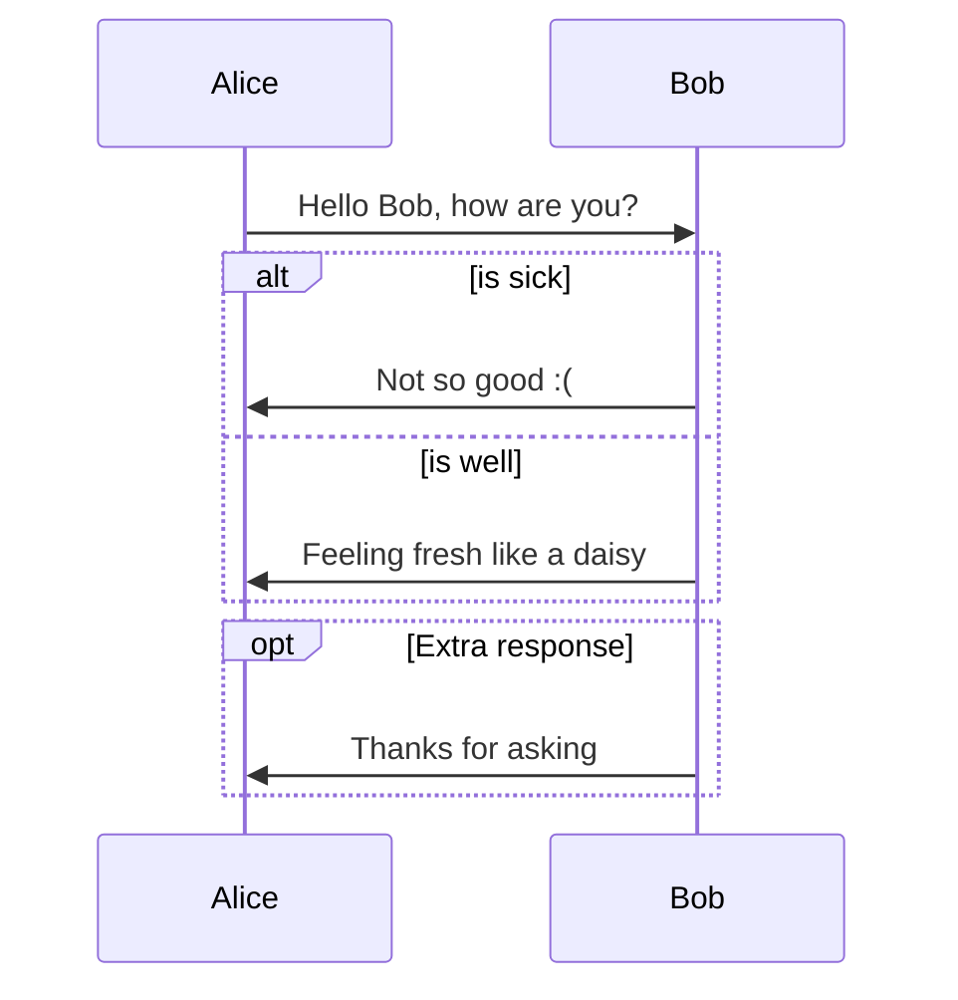
#### 类图 Class diagram
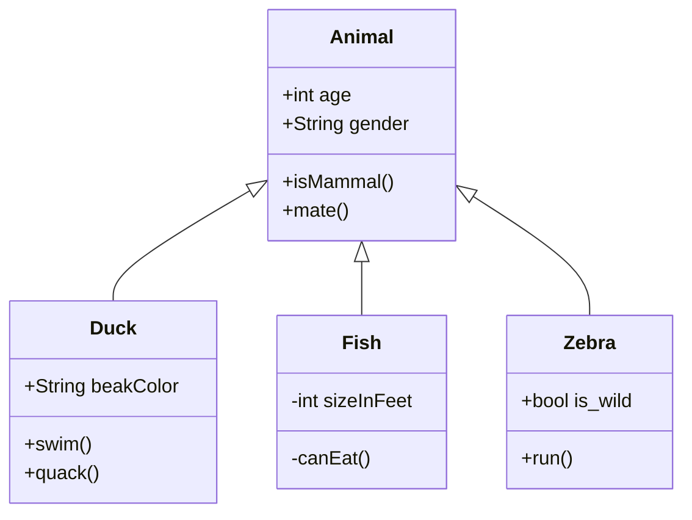

#### 状态图 State diagram
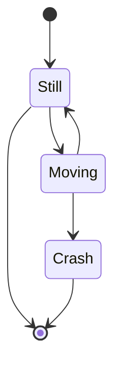
#### 实体关系图 Entity Relationship Diagram(ER model)
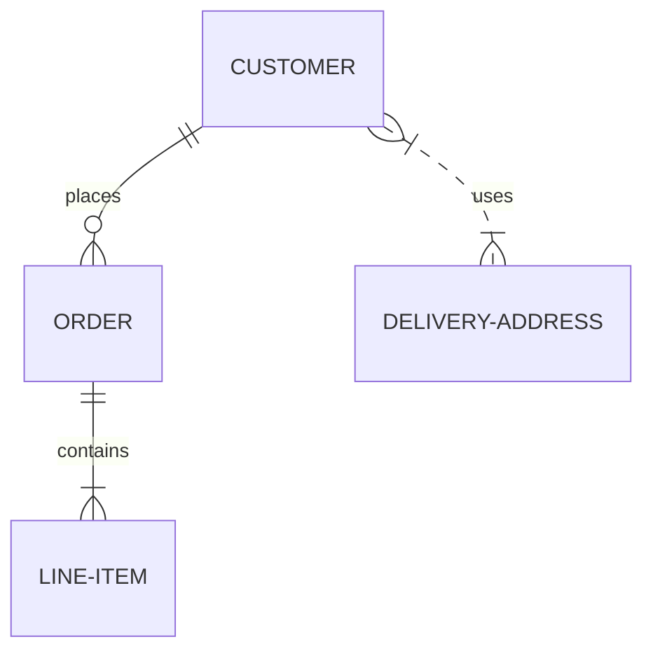
#### User Journey Diagram
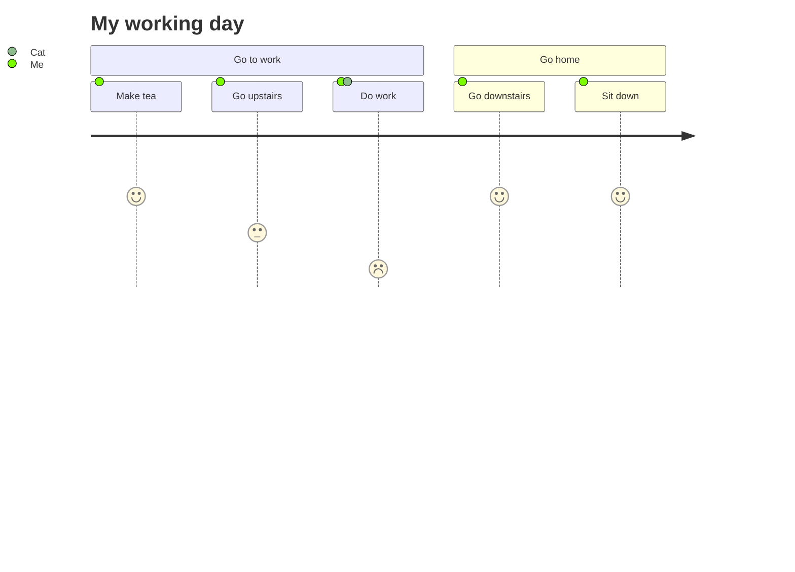

#### 甘特图 gantt

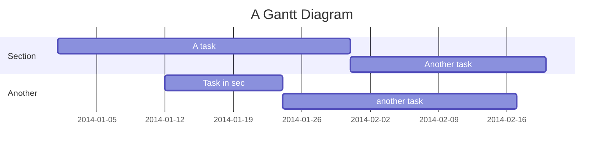

#### Pie chart diagram

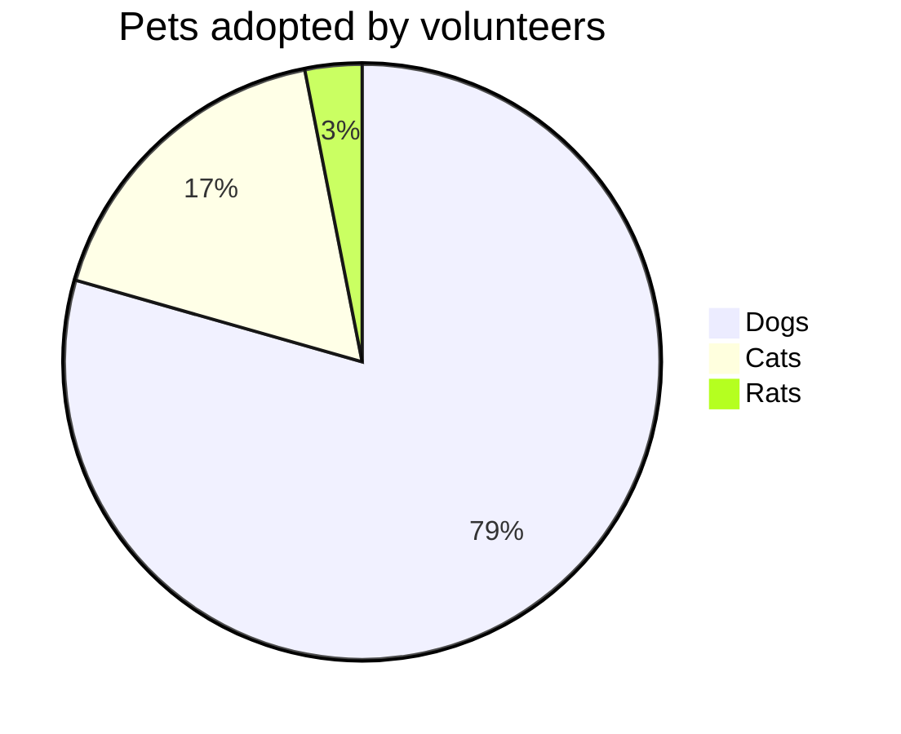